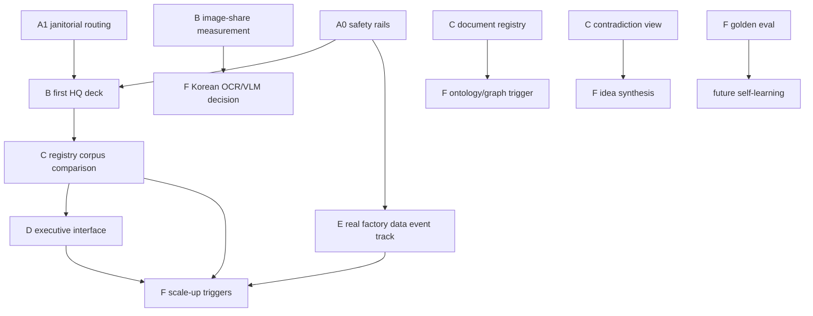

# Current Implementation Plan

Source of truth: `03_design/assistant_master_plan.md` v2, approved 2026-07-02.
This file turns the approved master plan into build order, gates, module targets,
test targets, and card expansion rules. It is planning only.

## Operating Rules

Read order: `AGENTS.md`, `CLAUDE.md`, `03_design/assistant_master_plan.md`,
`03_design/phase_a_cards.md`, `00_control/task_queue.md`, then the nearest module
`AGENTS.md` and real code.

Non-negotiables:
- A0 safety rails gate all LLM-on-real-document work.
- Numbers come only from data/query paths or citation-verified claims; the LLM
  layer may not originate a trusted number.
- Tier 1 factory data never leaves the machine. Tier 2 cloud use is limited to
  owner-marked HQ workflow documents.
- Every new capability is done only when it has engine code, tests, a skill card
  under `agent_skills/`, a routing-map entry in `AGENT_SKILL_MAP.md`, and an MCP
  tool in `mcp_server/server.py`.
- No code without a task-queue row.

## Current Repo Surfaces

| Area | Existing paths to reuse |
|---|---|
| Shared contracts | `shared/contracts/models.py` |
| Data engine | `engines/data/ingest.py`, `engines/data/clean.py`, `engines/data/variance.py`, `engines/data/drivers.py` |
| Document engine | `engines/docs/extract.py`, `engines/docs/models.py`, `engines/docs/ocr.py`, `engines/docs/report_reader.py`, `engines/docs/search.py` |
| Brain and memory | `engines/brain/memory.py`, `engines/brain/claims.py`, `engines/brain/orchestrator.py`, `engines/brain/factory.py` |
| Audit | `engines/audit/audit.py` |
| Serving | `serving/card.py`, `serving/open_design.py` |
| Governance | `gov/access.py`; planned `gov/privacy.py`, `gov/ledger.py` |
| MCP | `mcp_server/server.py` dispatch table |
| Skills | `agent_skills/*.md`, routed by `AGENT_SKILL_MAP.md` |

## Improvement Build Map

| # | Improvement | Phase | Dependencies | Module/file target | Contract needed | Test target |
|---|---|---|---|---|---|---|
| 1 | Deterministic figure verifier | A0 | none | new `engines/docs/verify.py` | numeric token and exact figure-match functions | `tests/test_verify.py` |
| 2 | Korean-units-aware verification | A0 | 1 | `engines/docs/verify.py` | Korean scale normalization for eok, man, cheon, dates, percents | `tests/test_verify.py` |
| 3 | Separate facts and claims stores | A0 | none | existing `engines/brain/claims.py`, `engines/brain/memory.py` | `ClaimsStore` cannot write to `.brain/knowledge.json` or `.brain/temporal.json` | `tests/test_claims.py` |
| 4 | Single LLM chokepoint and bypass guard | A0 | 1,2,3,6,8,9 | `engines/docs/report_reader.py`, new `tests/test_llm_chokepoint.py` | all LLM calls pass tier gate, ledger, verifier, claims wall | `tests/test_llm_chokepoint.py` |
| 5 | Provenance tags on rendered numbers | A0 | 3 | `shared/contracts/models.py`, `serving/card.py`, `serving/open_design.py` | tag derived from `EvidenceRef.source`; unknown prefix fails closed | `tests/test_serving.py` |
| 6 | Citation-support verification | A0 | 1,2 | `engines/docs/verify.py` | cited page/slide must contain numbers and key terms | `tests/test_verify.py` |
| 7 | Prompt-injection defense | A0 | 4,6 | new `engines/docs/prompt_builder.py`, `engines/docs/report_reader.py` | document text delimited as untrusted input | `tests/test_prompt_injection.py` |
| 8 | Privacy tier gate | A0 | none | new `gov/privacy.py` | default Tier 1; Tier 1 external send raises | `tests/test_privacy.py` |
| 9 | External-call ledger | A0 | 8 | new `gov/ledger.py` | append-only `.brain/external_call_ledger.jsonl` | `tests/test_privacy.py` |
| 10 | Non-numeric audit | B | 4,6,7 | new `engines/audit/brief_audit.py` beside `audit.py` | independent claim re-extraction plus citation re-check | `tests/test_brief_audit.py` |
| 11 | Native PPTX input extractor | B | A0 gate | new `engines/docs/pptx.py`, edit `engines/docs/extract.py` | PPTX slides produce `Document`/`Page` shape | `tests/test_pptx_extraction.py` |
| 12 | Chunked map-reduce with coverage | B | A0 gate, 11 | new `engines/docs/summarize.py` | chunk manifest covers every page/slide or blocks | `tests/test_chunked_summary.py` |
| 13 | Repair `report_reader` tests | A0/A1 | 1-9 | `engines/docs/report_reader.py`, `tests/test_report_reader.py` | existing reader behavior plus safety gate wiring | `tests/test_report_reader.py` |
| 14 | WorkflowRecord schema | B | 11,12 | new `engines/docs/workflow_record.py`, `shared/contracts/models.py` | cited fields: purpose, steps, roles, KPIs, changes, open questions | `tests/test_workflow_record.py` |
| 15 | Original-language retention | B | 14 | `engines/docs/workflow_record.py` | each English field stores source-language text and locator | `tests/test_workflow_record.py` |
| 16 | Full provenance stamp | B | 14 | new `engines/docs/provenance.py`, `engines/docs/workflow_record.py` | hash, run id, model, prompt version, confidence inputs | `tests/test_provenance_stamp.py` |
| 17 | Korean-English glossary | B | 14,15 | new `engines/docs/glossary.py`, `agent_skills/document_evidence_extraction.md` | deterministic glossary match ratio and growth rules | `tests/test_glossary.py` |
| 18 | Back-translation spot check | B | 17 | new `engines/docs/translation_check.py` | critical terms checked with second model; disagreements flagged | `tests/test_translation_check.py` |
| 19 | Email and attachment intake | B/C | A0 gate, 21 | new `engines/email/extract.py`, `engines/email/AGENTS.md` | email body, metadata, attachments enter registry and doc spine | `tests/test_email_extraction.py` |
| 20 | Scanned/image-only Korean handling | B/F | 11,12; F trigger if high share | `engines/docs/ocr.py`, new `engines/docs/image_profile.py` | image-only share metric, Korean OCR readiness, review routing | `tests/test_korean_ocr_profile.py` |
| 21 | Document registry | C | B gate | new `engines/brain/registry.py` | source hash, tier, family, status, ingest run id | `tests/test_document_registry.py` |
| 22 | Workflow families and versioning | C | 14,21 | new `engines/brain/workflow_family.py` | valid-time separate from ingest-time | `tests/test_workflow_family.py` |
| 23 | Diff view | C | 22 | new `engines/brain/workflow_diff.py` | field-level "what changed" with citations | `tests/test_workflow_diff.py` |
| 24 | Canonical entity IDs and ontology | F | C gate; volume trigger | new `engines/brain/ontology.py`, later `shared/metrics/` | stable IDs for process, role, KPI, factory | `tests/test_ontology.py` |
| 25 | Typed cross-workflow edges | F | 21,24 | new `engines/brain/edges.py` | depends-on, conflicts-with, refines, supersedes | `tests/test_workflow_edges.py` |
| 26 | Open questions as queryable items | C | 14,21 | new `engines/brain/open_questions.py` | open/resolved/by-what with evidence | `tests/test_open_questions.py` |
| 27 | Decision-outcome linkage | C | 21,26 | existing `engines/brain/memory.py`, new `engines/learning/outcomes.py` | workflow records link to decision memory ids | `tests/test_decision_outcomes.py` |
| 28 | Knowledge artifacts in git | C | 14,21 | new `engines/wiki/artifacts.py`, `engines/wiki/AGENTS.md` | markdown artifacts, hash dedup, deterministic filenames | `tests/test_knowledge_artifacts.py` |
| 29 | Samsung IR quarter comparison | C | 21,23 | new `engines/brain/comparison.py` | public corpus records and period comparison | `tests/test_ir_comparison.py` |
| 30 | Contradiction-surfacing view | C | 3,21,25 | new `engines/brain/contradictions.py` | conflicts over claims/records, never auto-merged | `tests/test_contradictions.py` |
| 31 | Factory-vs-factory comparison only when data exists | F | 21,29; data trigger | `engines/brain/comparison.py` | availability gate and not-comparable result | `tests/test_factory_comparison_gate.py` |
| 32 | Idea-synthesis briefs last | F | 30,37,46 | new `engines/brain/idea_synthesis.py` | outputs labeled `AI-SUGGESTED IDEA` with citations only | `tests/test_idea_synthesis.py` |
| 33 | Knowledge search skill | C | 21,22,26,30 | `engines/docs/search.py`, new `engines/brain/search.py` | linked records, claims, versions, questions | `tests/test_knowledge_search.py` |
| 34 | Decision brief generator | D | C gate, 5,10,33 | new `serving/decision_brief.py` | question, evidence, options, risks, recommendation, signoff | `tests/test_decision_brief.py` |
| 35 | Meeting pack assembler | D | 34 | new `serving/meeting_pack.py` | pulls audited numbers, workflow knowledge, risks, talking points | `tests/test_meeting_pack.py` |
| 36 | Report and article generator | D | 34 | new `serving/report_article.py` | management report, process explainer, rollout summary | `tests/test_report_article.py` |
| 37 | Named sign-off for all executive outputs | D | 34,35,36 | new `serving/signoff.py`, edit `serving/open_design.py` | unsigned executive output cannot render as released | `tests/test_executive_signoff.py` |
| 38 | Reuse dashboard and PPTX rendering | D | 34,37 | existing `serving/open_design.py` | shared rendering adapter for cards, briefs, packs | `tests/test_serving_outputs.py` |
| 39 | Owner feedback loop | D | 34,37 | new `engines/learning/feedback.py`, `00_control/restart_notes.md` | useful/corrected/wrong verdict stored with output id | `tests/test_feedback_loop.py` |
| 40 | Capability ships as skill, map, MCP | B-F | each capability | `agent_skills/*.md`, `AGENT_SKILL_MAP.md`, `mcp_server/server.py` | done-rule lint for new capabilities | `tests/test_skill_mcp_sync.py` |
| 41 | MCP access control at dispatch | F | 40 | `mcp_server/server.py`, `gov/access.py` | every dispatch checks role/scope before tool call | `tests/test_mcp_access.py` |
| 42 | Skill token budgets and contracts | F | 40 | `agent_skills/*.md`, `AGENT_SKILL_MAP.md` | each skill declares token budget, inputs, outputs, raw-data ban | `tests/test_skill_contracts.py` |
| 43 | Fallback model order and resumable runs | F | 12,16 | new `engines/docs/run_state.py`, `engines/docs/llm_bridge.py` | chunk checkpoints and provider fallback chain | `tests/test_resumable_runs.py` |
| 44 | AI build team operating model | A1/F | docs gate | existing `CLAUDE.md`, `00_control/run_log.md` | operating model remains documented and referenced | doc review plus `tests/test_skill_contracts.py` if linted |
| 45 | Session-state persistence | F | 39 | new `00_control/session_state.md`, optional `ops/session_state.py` | restart notes update from completed run summary | `tests/test_session_state.py` |
| 46 | Golden evaluation set | F | B gate | new `eval/`, `eval/AGENTS.md` | curated fixtures and expected extraction/brief outputs | `tests/test_golden_eval.py` |
| 47 | Doc consolidation | A1 | none | `archive/`, `AGENTS.md`, `00_control/*` | stale docs historical, live docs current | `tests/test_doc_archive.py` |
| 48 | First real SAP export and IS2.3/IS2.4 | E | external data arrival | `engines/data/ingest.py`, possibly `engines/data/profile.py` | multi-sheet and type-inference profile without silent drops | `tests/test_ingestion_spine.py` |
| 49 | Scheduled ingestion, backup, restore, alerting | F | 21,28 | new `ops/scheduler.py`, `ops/backup.py`, `ops/alerts.py`, `ops/AGENTS.md` | restore drill and alert records | `tests/test_ops_backup.py` |
| 50 | Quarterly plan review | F | D gate | `00_control/plan_review.md`, `03_design/assistant_master_plan.md` review notes | review ritual checklist and decision log | doc review |

## Phase Build Sequence And Gates

### A0 - Safety Rails

Cards are already defined in `03_design/phase_a_cards.md` and must not be
rewritten here. Build A0.1 through A0.8 before any real document is sent to an
LLM. A0 unlocks the ability to process owner-marked Tier 2 HQ workflow decks.

Gate:
- `tests/test_claims.py`, `tests/test_verify.py`, `tests/test_privacy.py`,
  `tests/test_llm_chokepoint.py`, `tests/test_prompt_injection.py`,
  `tests/test_report_reader.py`, and `tests/test_serving.py` pass.
- Full `pytest` and `ruff check .` pass.
- A test proves Tier 1 content cannot reach the LLM bridge.
- A test proves an uncited or unverifiable claim is quarantined, not trusted.

### A1 - Janitorial And Routing

Cards A1.1 and A1.2 are already passed. This phase keeps live docs pointed at
the approved plan and prevents stale architecture from being reintroduced.

Gate:
- `AGENTS.md`, `AGENT_SKILL_MAP.md`, `00_control/restart_notes.md`, and
  `00_control/task_queue.md` agree on the current plan and next action.

### B - First HQ Deck End To End

Build native PPTX extraction, chunked coverage, workflow records, provenance,
glossary, translation checks, email intake baseline, Korean image-share
measurement, and the non-numeric audit.

Gate:
- One owner-marked Tier 2 Korean HQ deck becomes an English one-page brief with
  every claim linked to a slide.
- Coverage report shows every slide accounted for.
- Owner judges the brief faithful and useful against the original deck.
- Image-only share is measured and recorded.

### C - Corpus, Registry, And Comparison

Build registry, workflow families, diffs, open questions, decision outcomes,
git-backed artifacts, Samsung IR comparison, contradiction view, and knowledge
search.

Gate:
- A quarter-over-quarter Samsung IR comparison brief exists from public-source
  records.
- The owner would show it to a colleague.
- Knowledge search returns records, versions, claims, and open questions without
  loading the full architecture.

### D - Executive Interface

Build decision briefs, meeting packs, report/article outputs, all-output
sign-off, rendering reuse, and feedback.

Gate:
- The owner uses one system-built management pack or brief in a real meeting and
  confirms it held up.
- Unsigned executive outputs cannot render as released.

### E - Real Factory Data Event Track

This is event-driven and outranks other work when the first real export arrives.
Finish P2.2, IS2.3, and IS2.4 against the real file profile without sending data
outside the machine.

Gate:
- Real export profile is recorded.
- Multi-sheet ingestion tracks `source_sheet`.
- Type inference keeps raw values and quarantines unconvertible critical cells.
- No total/subtotal or duplicate issue is silent.

### F - Scale-Up By Measured Trigger

Add heavy infrastructure only when the repo has evidence of need: ontology/graph,
MCP access enforcement, skill contracts, resumable runs, ops backup/restore,
golden eval, idea synthesis, and quarterly review.

Gate:
- Golden eval set exists and runs.
- Restore drill passes.
- MCP dispatch enforces access.
- Idea synthesis is gated, labeled, cited, and sign-off controlled.

## Hard Ordering Graph

## Definition Of Done For Every New Capability

1. Engine/module code in the correct existing area or a small sibling module.
2. Named targeted test plus full `pytest`.
3. Module `AGENTS.md` updated when public interface changes.
4. Skill card in `agent_skills/`.
5. Routing entry in `AGENT_SKILL_MAP.md`.
6. MCP tool or dispatch exposure in `mcp_server/server.py`.
7. Task row in `00_control/task_queue.md`.
8. If it can affect an executive output: audit path and named sign-off path.

## Open Risks And Owner Decisions Needed

| Risk or unknown | Why it matters | Decision needed |
|---|---|---|
| Korean image-only deck share unknown | Determines whether human review is enough or VLM/OCR becomes urgent | Measure first five real HQ decks; owner decides review capacity threshold |
| Cloud translation quality vs on-prem translation | Tier 2 allows cloud, but trust still depends on repeatable quality | Owner approves preferred translation provider/fallback after B gate evidence |
| Human review queue capacity | Low-confidence OCR and translation disagreements can overwhelm the owner | Define maximum weekly review load before automation priority increases |
| Critical glossary ownership | Wrong Korean factory terms can corrupt summaries | Owner names the final reviewer for glossary corrections |
| Real SAP export availability | E phase cannot finish without the real file | Owner supplies first export or confirms synthetic-only delay |
| Git artifact policy | Knowledge artifacts should be committed, but automation needs clear commit rules | Owner decides whether artifact commits are manual only or scheduled |
| Email privacy tier classification | Emails are normally Tier 1 and often sensitive | Owner confirms whether any email class can ever be Tier 2 |
| Factory-vs-factory reports | Comparison is blocked until actual comparable reports exist | Owner supplies documents or keeps card gated |

